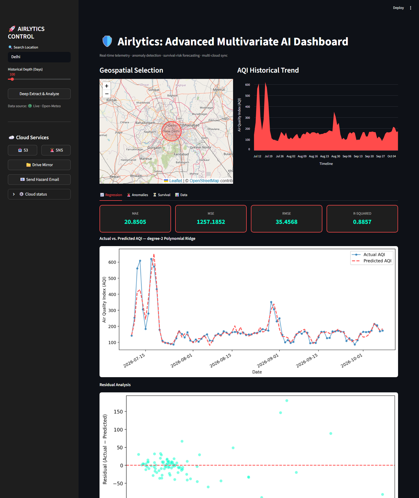
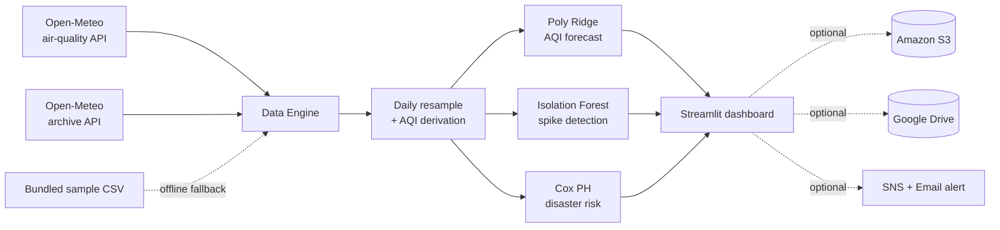

# 🛡️ Airlytics

**AI-powered air-quality intelligence — forecasting, anomaly detection and survival-risk modelling on live telemetry, with optional multi-cloud sync.**

**Live Demo:** https://airlytics08.streamlit.app/

[](https://airlytics08.streamlit.app/)




---

## What it does

Airlytics pulls **live and historical air-quality telemetry** for any point on Earth, then runs three different machine-learning lenses over it:

| Stage | Model | Question it answers |
|---|---|---|
| **Regression** | Polynomial Ridge (degree auto-selected) | *What will the AQI be?* |
| **Anomaly detection** | Isolation Forest | *Which spikes are abnormal?* |
| **Survival analysis** | Cox Proportional Hazards | *How likely is an environmental disaster within N days?* |

Results can be mirrored to **Amazon S3 / SNS** and **Google Drive**, and dispatched as an **email hazard report** — all strictly optional, so the app runs on a bare laptop with no cloud accounts.

## Quick start

```bash
git clone https://github.com/anmoljames/Airlytics.git
cd Airlytics
pip install -r requirements.txt
streamlit run app.py
```

That's it — **no API keys required.** Telemetry comes from the [Open-Meteo](https://open-meteo.com/) air-quality and archive APIs, and the dashboard auto-loads Delhi on first paint so it is never empty.

Want the cloud features? Copy the template and fill in only what you have:

```bash
cp .env.example .env
```

## How it works



**Design decisions worth knowing about:**

- **Degrades gracefully, always.** Every network call and every cloud integration is wrapped. If Open-Meteo is unreachable the app silently switches to a bundled sample dataset and says so in the sidebar — it can never crash into a blank screen.
- **Model complexity tracks sample size.** Degree-4 polynomial regression is only identifiable with plenty of observations, so the degree is chosen as 4 / 3 / 2 depending on whether you load 1500 / 250 / 30 days.
- **No silent side effects.** Alerts are *never* sent automatically on page load — you press the button.

## Model results

Evaluated on live Delhi telemetry, 91 daily observations (2026-07-10 → 2026-10-08):

| Metric | Value |
|---|---|
| R² (in-sample) | **0.886** |
| Mean Absolute Error | **20.85 AQI** |
| Root Mean Squared Error | **35.46 AQI** |
| 5-fold cross-validated R² | **0.606 ± 0.331** |
| Anomalies flagged (Isolation Forest, 5% contamination) | **5 / 91** |
| Observed AQI range | **86 – 620** (mean 177) |

The cross-validated score is reported alongside the in-sample score deliberately — the gap is the honest generalisation error, and is the reason the dashboard exposes its residuals.

Full exploratory analysis, correlation-driven feature selection, K-fold validation and Cox model derivation live in
[`notebooks/research_and_training.ipynb`](notebooks/research_and_training.ipynb).

## Features

- 🗺️ **Interactive Folium map** — click any point to reverse-geocode and reload telemetry for it
- 🔍 **Text search** — jump to any city, with adjustable historical depth (30 – 1500 days)
- 📈 **Regression tab** — MAE / MSE / RMSE / R² cards, actual-vs-predicted overlay, residual analysis
- 🚨 **Anomaly tab** — spike scatter, anomaly-score distribution, flagged-sample count
- ⏳ **Survival tab** — adjustable risk window, Cox partial-effect curves, hazard probability gauge
- 📊 **Data tab** — correlation heatmap, descriptive statistics, one-click CSV export
- ☁️ **Cloud tab-in-sidebar** — S3 sync, SNS publish, Google Drive mirror, SMTP hazard email

## Tech stack

**Streamlit · Folium · scikit-learn · lifelines · pandas · NumPy · Matplotlib · Seaborn · geopy · boto3 · Google API client**

## Project structure

```
Airlytics/
├── app.py                          # the dashboard
├── notebooks/
│   └── research_and_training.ipynb # EDA, feature selection, CV, Cox derivation
├── data/
│   ├── AirQuality.csv              # UCI air-quality corpus used for training
│   └── latest_pollution_data.csv   # offline fallback dataset
├── models/                         # serialised sklearn estimators
├── requirements.txt
├── .env.example                    # configuration template
└── .streamlit/config.toml          # dark theme
```

## Security notes

Secrets are read **exclusively** from the environment — nothing sensitive lives in source control.

- `.gitignore` blocks `.env`, `cloud_key.json`, key files and Streamlit secrets.
- The Gmail app password, service-account keys and AWS credentials are all supplied at runtime via `.env` or your normal `~/.aws` profile.
- If a credential is missing, the corresponding button reports *"not configured"* instead of failing.

## Author

**Anmol James R** — [github.com/anmoljames](https://github.com/anmoljames)

Final-year project. Licensed under the [MIT License](LICENSE).
